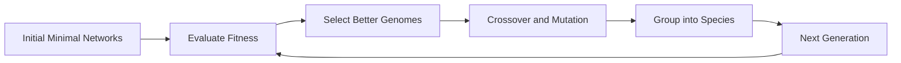
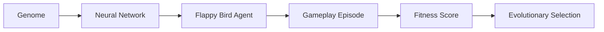
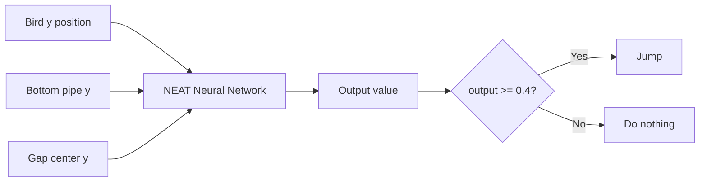
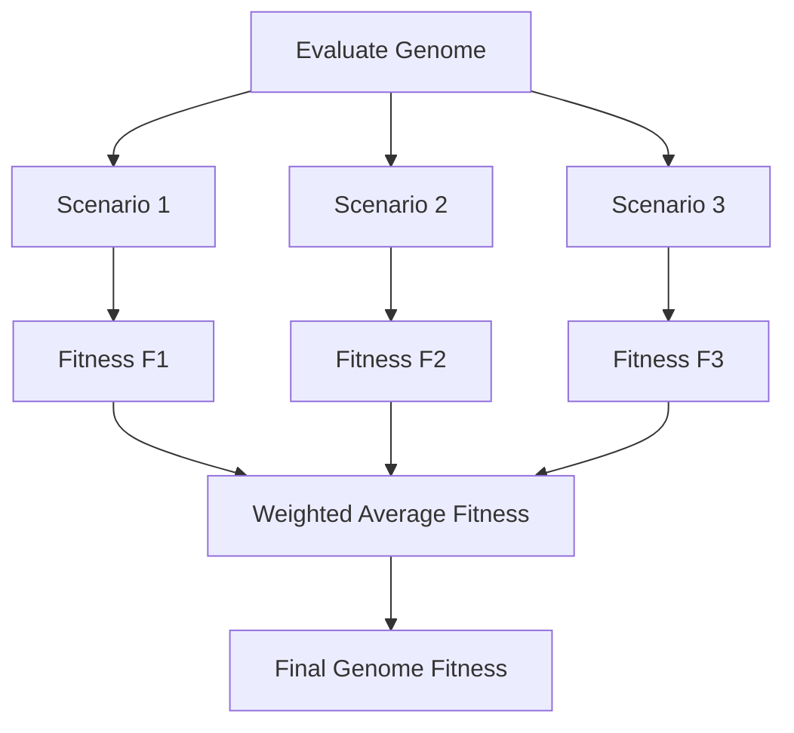
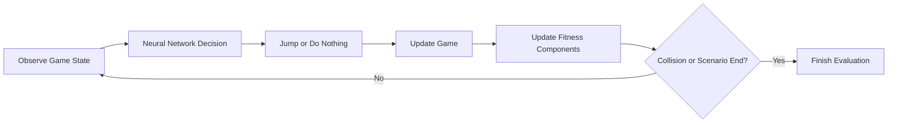
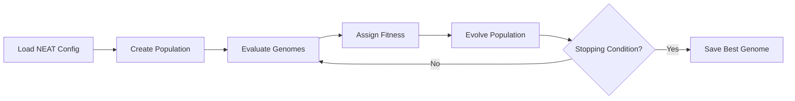

# 🧠 Flappy-NEAT-Minimal

<p>
  
  
  
  
  
  
  
  
  
</p>

A minimal and educational implementation of a **NEAT-based Flappy Bird agent**, inspired by the paper:

> 📄 [**A Minimal Training Strategy to Play Flappy Bird Indefinitely with NEAT**](https://www.sbgames.org/sbgames2019/files/papers/ComputacaoFull/198468.pdf)

The project uses **NEAT**, or **NeuroEvolution of Augmenting Topologies**, to evolve a neural controller capable of playing Flappy Bird for very long periods. The key idea is to simplify the training process through **controlled scenario generation**, allowing evolution to focus on representative obstacle configurations instead of relying only on random gameplay.

---

## 🎥 Demo

A sample of the trained NEAT agent playing Flappy Bird is available here:

[Watch the trained NEAT agent playing Flappy Bird](https://drive.google.com/file/d/1Zqpkouve4UABpY74isQuIck13BtWacKS/view?usp=sharing)

If the repository includes a local video file, it can also be stored as:

```text
assets/demo_result.mp4
```

---

## 📌 Overview

This repository explores how a neural network can be evolved to control a Flappy Bird agent using a minimal training strategy.

The project combines:

```text
NEAT neuroevolution
Flappy Bird gameplay
controlled scenario generation
custom fitness evaluation
modified PLE environment
neural network visualization
training statistics
agent evaluation with GUI
```

The goal is not only to make the agent play well, but also to show how a carefully designed training setup can make the learning process simpler, faster, and more interpretable.

---

## 🧭 Conceptual Map

```mermaid
graph TD
    project_root["Flappy-NEAT-Minimal"] --> paper_basis["Paper-Based Strategy"]
    project_root --> neat_algo["NEAT Algorithm"]
    project_root --> game_env["Flappy Bird Environment"]
    project_root --> training_loop["Training Loop"]
    project_root --> evaluation["Evaluation"]
    project_root --> visualization["Visualizations"]

    paper_basis --> minimal_strategy["Minimal Training Strategy"]
    paper_basis --> controlled_scenarios["Controlled Scenario Generation"]
    paper_basis --> compact_policy["Compact Neural Policy"]

    neat_algo --> genomes["Genomes"]
    neat_algo --> networks["Neural Networks"]
    neat_algo --> speciation["Speciation"]
    neat_algo --> mutation["Mutation"]
    neat_algo --> crossover["Crossover"]
    neat_algo --> fitness["Fitness Function"]

    game_env --> ple_custom_node["ple_custom"]
    game_env --> bird_state["Bird State"]
    game_env --> pipe_state["Pipe State"]
    game_env --> actions["Jump / Do Nothing"]

    training_loop --> scenarios["Three Evaluation Scenarios"]
    training_loop --> score_metric["Pipe Score"]
    training_loop --> survival_metric["Frames Survived"]
    training_loop --> alignment_metric["Gap-Center Alignment"]

    evaluation --> best_genome["Best Genome"]
    evaluation --> live_game["Live Gameplay"]
    evaluation --> score_window["PyQt5 Score Display"]

    visualization --> fitness_plot["Fitness Curves"]
    visualization --> species_plot["Species Curves"]
    visualization --> network_graph["Network Graph"]
```



---

## ✅ Main Usage per File

| File | Description |
|---|---|
| `scr/train_agent.py` | Trains a NEAT population using the custom Flappy Bird environment and controlled training scenarios. |
| `scr/evaluate_agent.py` | Loads the best genome or checkpoint and runs the trained agent in the game environment. |
| `scr/neat_visualizations.py` | Generates visualizations for fitness evolution, species behavior, and neural network topology. |
| `scr/score_display_window.py` | Implements a PyQt5 GUI component to display the current score during evaluation. |
| `config/flappy_neat_feedforward_config` | NEAT configuration file defining genome, population, network, reproduction, species, and stagnation parameters. |
| `ple_custom/` | Modified PyGame Learning Environment with deterministic pipe-gap control and scenario customization. |
| `ple_custom/NOTICE.txt` | Documents the origin, authorship, and changes made to the modified PLE code. |
| `assets/demo_result.mp4` | Optional local video showing the trained agent playing Flappy Bird. |
| `LICENSE` | MIT license for the repository. |

---

## 📂 Repository Structure

```text
flappy-neat-minimal/
│
├── assets/
│   └── demo_result.mp4
│
├── config/
│   └── flappy_neat_feedforward_config
│
├── ple_custom/
│   ├── NOTICE.txt
│   └── ...
│
├── scr/
│   ├── train_agent.py
│   ├── evaluate_agent.py
│   ├── neat_visualizations.py
│   └── score_display_window.py
│
├── requirements.txt
├── LICENSE
└── README.md
```

> Note: The folder name `scr/` is preserved here because it appears in the project structure. If desired, it can later be renamed to the more common `src/` convention.

---

## 🧠 Dependencies & Libraries

| Library / Tool | Purpose |
|---|---|
| Python 3.10+ | Main programming language. |
| neat-python 0.92 | NEAT implementation used to evolve neural networks. |
| NumPy 1.26.4 | Numerical operations, statistics, arrays, and fitness-related computations. |
| Matplotlib 3.8.0 | Plotting fitness curves and training statistics. |
| Graphviz 2.50+ | Rendering evolved neural network topology graphs. |
| PyQt5 5.15.9 | GUI score display during agent evaluation. |
| Custom PLE | Modified PyGame Learning Environment used as the Flappy Bird interface. |

---

## 📘 Computational Concepts

This project demonstrates several important computational and artificial intelligence concepts:

```text
Neuroevolution
NEAT algorithm
Evolutionary computation
Artificial neural networks
Topology optimization
Speciation
Fitness shaping
Controlled scenario generation
Game AI
Agent evaluation
Reinforcement-learning-style environment interaction
Deterministic testing
Visualization of training dynamics
```

---

# 🧬 NEAT Algorithm Background

<p align="center">
  
</p>

<p align="center">
  <em>Reference topology of a feedforward artificial neural network. In this project, NEAT starts from compact neural structures and evolves both connection weights and topology.</em>
</p>

NEAT stands for **NeuroEvolution of Augmenting Topologies**.

Unlike approaches that train a fixed neural network architecture, NEAT evolves both:

```text
connection weights
global neural topology
```

This means the algorithm can start with a simple neural network and gradually add complexity only when useful.

---

## Core NEAT Idea



NEAT is especially useful when the best network structure is unknown in advance.

Instead of manually choosing hidden layers and neurons, the evolutionary process can discover a structure that is sufficient for the task.

---

## Genomes, Networks, and Fitness


<p align="center">
  <em>Network topology examples. This visual idea is useful here because NEAT does not only tune numerical weights; it can also modify the structure of the neural controller over generations.</em>
</p>

In NEAT, each candidate solution is represented by a **genome**.

A genome encodes:

```text
nodes
connections
connection weights
connection enabled/disabled status
innovation numbers
```

The genome is decoded into a neural network, and the neural network controls the Flappy Bird agent.



---

## Speciation Distance

NEAT groups similar genomes into species to protect new structural innovations during evolution.

The compatibility distance can be written as:

$$
\delta = c_1 \cdot \frac{E}{N} + c_2 \cdot \frac{D}{N} + c_3 \cdot \bar{W}
$$

where:

- $E$ is the number of excess genes;
- $D$ is the number of disjoint genes;
- $\bar{W}$ is the average weight difference of matching genes;
- $N$ is a normalization factor;
- $c_1$, $c_2$, and $c_3$ are speciation coefficients.

This distance helps NEAT decide whether two genomes belong to the same species.

---

## Mutation Operators

The evolutionary process may modify genomes through mutations such as:

```text
changing connection weights
adding a new connection
adding a new node
re-enabling disabled connections
altering biases or activation parameters
```

These mutations allow the population to explore both parameter space and topology space.

---

# 🎮 Game Domain: Flappy Bird

<p align="center">
  
</p>

<p align="center">
  <em>Flappy Bird-style clone environment. This image helps contextualize the type of side-scrolling obstacle-avoidance task used by the NEAT agent: the bird must repeatedly pass through pipe gaps by choosing when to jump.</em>
</p>

Flappy Bird is a simple but useful control problem.

The agent must decide when to jump so that the bird passes through pipe gaps without colliding.

The game has only a small action set, but successful behavior requires precise timing.

---

## Agent Inputs and Output

The minimal agent receives three inputs:

| Input | Meaning |
|---|---|
| $y_p$ | Player vertical position. |
| $y_b$ | Bottom pipe vertical position. |
| $y_c$ | Pipe gap center, computed as $y_c = \frac{y_t + y_b}{2}$. |

The neural network produces one output:

```text
jump if output >= 0.4
otherwise do nothing
```

This creates a compact policy representation:



---

## Why Minimal Inputs Matter

The input design is intentionally small.

Instead of feeding the whole screen or many game variables, the agent receives only the most relevant spatial information.

This reduces the search space and allows NEAT to focus on learning a simple control rule:

```text
stay aligned with the pipe gap center
jump only when needed
avoid over-correction
survive long enough to pass pipes
```

---

# 🧪 Controlled Scenario Generation

A central idea of this project is that training can be simplified by controlling the environment.

Instead of exposing the agent to fully random pipe configurations from the beginning, the environment can generate specific scenarios that represent important game situations.

---

## Scenario-Based Training

The agent is evaluated across multiple scenarios.

Each scenario defines a controlled pipe-gap position or gameplay condition.



This approach encourages the evolved agent to generalize across representative obstacle placements.

---

## Benefits of Controlled Scenarios

Controlled scenario generation helps by:

```text
reducing randomness during evaluation
making fitness comparisons more consistent
exposing genomes to representative conditions
encouraging generalization across pipe positions
reducing convergence time
making experiments easier to reproduce
```

---

# 🧮 Custom Fitness Function

The project uses a fitness function that combines survival, score, and pipe-gap alignment.

For each scenario $s_i$:

$$
F_i = w_1 \cdot \frac{P}{195} + w_2 \cdot \frac{S}{3} - w_3 \cdot \frac{|y_p - y_c|}{\text{height}}
$$

where:

- $P$ is the number of frames survived;
- $S$ is the number of pipes passed;
- $y_p$ is the player vertical position;
- $y_c$ is the center of the pipe gap;
- $\text{height}$ is the game screen height;
- $w_1$, $w_2$, and $w_3$ are weighting coefficients.

---

## Final Fitness Across Scenarios

The final fitness is computed as a weighted average across three scenarios:

$$
F = \frac{F_1 \cdot p_1 + F_2 \cdot p_2 + F_3 \cdot p_3}{p_1 + p_2 + p_3}
$$

where:

- $F_1$, $F_2$, and $F_3$ are scenario fitness values;
- $p_1$, $p_2$, and $p_3$ are scenario weights.

This blends different behavior objectives into a single evolutionary score.

---

## Fitness Interpretation

The fitness function rewards the agent for:

```text
surviving more frames
passing more pipes
staying close to the pipe-gap center
generalizing across multiple scenarios
```

It penalizes the agent when the vertical position is far from the center of the next gap.

This encourages smoother and more stable behavior than using raw score alone.

---

# 🎮 About the Custom PLE Environment

<p align="center">
  
</p>

<p align="center">
  <em>Agent-environment interaction model. In this repository, the evolved neural network acts as the agent, while the modified PLE Flappy Bird environment provides observations, transitions, and gameplay feedback used to compute fitness.</em>
</p>

This project uses a modified version of the **PyGame Learning Environment**, stored in:

```text
ple_custom/
```

The original PLE provides a reinforcement-learning-style interface for game environments. In this project, PLE is adapted to support deterministic and controlled Flappy Bird training.

---

## Custom Modifications

The custom environment includes changes such as:

```text
control over pipe-gap positioning
deterministic scenario generation
custom game reset behavior
support for repeated controlled evaluations
compatibility with the NEAT training loop
```

All modifications and third-party notices should be documented in:

```text
ple_custom/NOTICE.txt
```

---

## Environment Interaction Loop



---

# 🧱 Current Architecture

The repository is organized around training, evaluation, visualization, and environment customization.

---

## 🏋️ `scr/train_agent.py`

Main script for evolving the Flappy Bird agent.

### Responsibilities

```text
load NEAT configuration
initialize population
create controlled scenarios
evaluate genomes
compute custom fitness
save checkpoints or best genome
plot training statistics
```

### Training Flow



---

## 🎯 `scr/evaluate_agent.py`

Script for running a trained genome in the Flappy Bird environment.

### Responsibilities

```text
load the best genome or checkpoint
build the neural network
connect the network to the game state
run live gameplay
show game output
show current score in the PyQt5 display
```

During evaluation:

```text
close the Pygame window to stop gameplay
press Ctrl+C in the terminal if the process remains active after collision
```

---

## 📊 `scr/neat_visualizations.py`

Utility module for visualizing the evolution process.

### Possible Outputs

```text
best fitness per generation
average fitness per generation
species size over generations
neural network topology graph
node and connection visualization
```

Graphviz is used when rendering neural network graphs.

---

## 🪟 `scr/score_display_window.py`

PyQt5 component for displaying the current score during evaluation.

This file helps separate the score display logic from the main game evaluation loop.

---

## ⚙️ `config/flappy_neat_feedforward_config`

Configuration file used by neat-python.

It defines parameters such as:

```text
population size
fitness threshold
activation functions
number of inputs
number of outputs
mutation rates
species compatibility coefficients
reproduction behavior
stagnation behavior
```

For this project, the controller is configured around:

```text
3 inputs
1 output
feedforward neural network
```

---

# ⏱️ Time and Space Complexity

Let:

```text
G = number of generations
P = population size
S = number of scenarios per genome
T = maximum frames evaluated per scenario
C = average neural network computation cost per frame
```

---

## Training Complexity

Each genome is evaluated over multiple scenarios, and each scenario runs for up to a maximum number of frames.

The approximate training cost is:

$$
O(G \cdot P \cdot S \cdot T \cdot C)
$$

If the neural networks are small, $C$ is close to constant, giving:

$$
O(G \cdot P \cdot S \cdot T)
$$

---

## Complexity Summary

| Operation | Time Complexity | Space Complexity | Notes |
|---|---:|---:|---|
| One network decision | $O(C)$ | $O(1)$ | Depends on number of nodes and enabled connections. |
| One scenario evaluation | $O(T \cdot C)$ | $O(1)$ | Runs frame by frame until collision or scenario end. |
| One genome evaluation | $O(S \cdot T \cdot C)$ | $O(1)$ | Combines multiple scenario evaluations. |
| One generation | $O(P \cdot S \cdot T \cdot C)$ | $O(P)$ | Evaluates every genome in the population. |
| Full training run | $O(G \cdot P \cdot S \cdot T \cdot C)$ | $O(P + H)$ | $H$ stores history/statistics/checkpoints. |
| Visualization plots | $O(G)$ | $O(G)$ | Uses generation history. |
| Network graph rendering | $O(N_n + N_c)$ | $O(N_n + N_c)$ | $N_n$ nodes and $N_c$ connections. |

---

## Space Complexity Notes

The main memory usage comes from:

```text
NEAT population genomes
species information
checkpoint data
training statistics
current game state
best genome object
rendered visualization data
```

For typical educational runs, memory usage is dominated by the population and training history.

---

# ▶️ How to Run

## 🔧 Recommended Installation with Conda

Using a dedicated environment is recommended to avoid dependency conflicts.

```bash
conda create -n flappy-neat python=3.10
conda activate flappy-neat
```

Clone the repository:

```bash
git clone https://github.com/youruser/flappybird-neat-minimal.git
cd flappybird-neat-minimal
```

Install Python dependencies:

```bash
pip install -r requirements.txt
```

---

## 🔧 Alternative Installation with venv

```bash
python -m venv .venv
```

Linux/macOS:

```bash
source .venv/bin/activate
```

Windows PowerShell:

```powershell
.\.venv\Scripts\Activate.ps1
```

Then install dependencies:

```bash
pip install -r requirements.txt
```

---

## 🧩 Installing Graphviz

Graphviz must be installed both as a Python dependency and as a system executable if network graph rendering is used.

### Ubuntu / Debian

```bash
sudo apt update
sudo apt install graphviz
```

### Windows

Download and install Graphviz from the official page:

```text
https://graphviz.org/download/
```

After installation, make sure the Graphviz `bin` folder is available in the system `PATH`.

---

## 🚀 Training the Agent

Run:

```bash
python scr/train_agent.py
```

This script will:

```text
load the NEAT configuration
start the population evolution
evaluate genomes in controlled scenarios
compute custom fitness values
save or report the best genome
plot training statistics
```

---

## 🎯 Evaluating the Agent

Run:

```bash
python scr/evaluate_agent.py
```

This script will:

```text
load the best genome or checkpoint
instantiate the neural network
run the agent in Flappy Bird
show the game window
show the current score using PyQt5
```

To stop evaluation:

```text
close the Pygame window
or press Ctrl+C in the terminal if needed
```

---

# 📊 Expected Outputs

Depending on the current implementation and configuration, the project may generate:

```text
best genome file
NEAT checkpoints
fitness history plots
species evolution plots
neural network topology images
evaluation gameplay window
score display window
```

Possible output files include:

```text
best_genome.pkl
neat-checkpoint-*
fitness.svg
fitness.png
species.svg
species.png
network.svg
network.png
```

The exact names may vary depending on the script implementation.

---

# 🧪 Behavior Summary

The training process follows this general behavior:

```text
1. Load the NEAT configuration.
2. Create an initial population of small neural networks.
3. Evaluate each genome in multiple controlled scenarios.
4. Convert game performance into a fitness value.
5. Select better genomes.
6. Apply crossover and mutation.
7. Preserve useful innovations through speciation.
8. Repeat for multiple generations.
9. Save the best genome.
10. Evaluate the trained agent in live gameplay.
```

---

# 🧭 Suggested Study Path

A good study order for this repository is:

```text
1. Flappy Bird game mechanics
2. Agent state representation
3. Neural network inputs and output
4. Fitness function design
5. Controlled scenario generation
6. NEAT genome representation
7. Mutation and crossover
8. Speciation and compatibility distance
9. Training loop implementation
10. Checkpoint and best genome saving
11. Evaluation script
12. Training visualizations
13. Neural topology visualization
14. Custom PLE modifications
```

This order starts with the game environment and gradually moves toward neuroevolution details.

---

# 🧰 Technologies and Tools

| Tool / Library | Purpose |
|---|---|
| Python | Main implementation language. |
| neat-python | NEAT algorithm implementation. |
| NumPy | Numerical operations and statistics. |
| Matplotlib | Fitness and species plots. |
| Graphviz | Neural network topology rendering. |
| PyQt5 | Score display GUI. |
| PLE | Game environment interface. |
| Pygame | Underlying game rendering and event loop through PLE. |
| Pickle | Saving and loading genomes or checkpoints when used. |
| Git | Version control. |

---

# 🧭 Future Improvements

Possible improvements include:

- Add a GIF preview directly to the README
- Add local screenshots of the trained agent
- Add a `docs/` folder with diagrams and explanations
- Add a `results/` folder for plots and best genomes
- Add deterministic random seeds for reproducibility
- Add command-line arguments for training and evaluation
- Add configurable scenario definitions
- Add hyperparameter comparison experiments
- Add ablation studies for each fitness component
- Add comparison against random or rule-based agents
- Add support for parallel genome evaluation
- Add better checkpoint naming and restoration options
- Add CI checks for import and formatting
- Add unit tests for fitness calculation
- Add unit tests for scenario generation
- Add documentation for each NEAT configuration parameter
- Add a notebook explaining the training process interactively
- Add Docker support for environment reproducibility
- Add automatic export of fitness and species plots
- Add README troubleshooting for Pygame/PyQt display issues

---

# ⚠️ Troubleshooting

## Graphviz not found

If network visualization fails with a Graphviz-related error, check that Graphviz is installed as a system program and available in `PATH`.

```bash
dot -V
```

If the command is not found, reinstall Graphviz and update your environment variables.

---

## PyQt5 window does not open

If the score display window does not open:

```text
verify PyQt5 installation
try running in a local desktop environment
avoid headless terminals unless virtual display support is configured
```

---

## Pygame window does not close cleanly

If the game window closes but the terminal process keeps running:

```text
press Ctrl+C in the terminal
check whether the PyQt5 event loop is still active
make sure evaluation cleanup logic is executed
```

---

## Dependency conflicts

Use a dedicated environment:

```bash
conda create -n flappy-neat python=3.10
conda activate flappy-neat
pip install -r requirements.txt
```

---

# ⚠️ Notes

- This repository is educational and experimental.
- The project uses a modified version of PLE stored in `ple_custom/`.
- Controlled scenarios are used to make training more consistent and efficient.
- The neural controller intentionally uses a small input space.
- Training results may vary depending on random seeds, NEAT parameters, and environment details.
- Graphviz must be installed correctly for topology rendering.
- PyQt5 and Pygame may require a graphical desktop environment.
- For reproducible experiments, record random seeds, configuration files, and generated checkpoints.

---

# 🖼️ Image Credits and Licenses

| Image | Author / Source | License | Link |
|---|---|---|---|
| Artificial Neural Network | Cburnett / Wikimedia Commons | GFDL and CC BY-SA 3.0 | [File page](https://commons.wikimedia.org/wiki/File:Artificial_neural_network.svg) |
| Network Topologies | Maksim / Malyszkz / Wikimedia Commons | Public domain | [File page](https://commons.wikimedia.org/wiki/File:NetworkTopologies.svg) |
| Flappy Bird Clone Screenshot | Antimundo / Wikimedia Commons | CC BY-SA 4.0 | [File page](https://commons.wikimedia.org/wiki/File:Godot4.6-beta-flappy-bird.png) |
| Agent-Environment Diagram | MartinThoma / Wikimedia Commons | CC0 1.0 Public Domain Dedication | [File page](https://commons.wikimedia.org/wiki/File:Agent-environment-diagram-rl.svg) |

---

# 📄 Third-Party Notice

This repository includes a modified version of the [PyGame Learning Environment](https://github.com/ntasfi/PyGame-Learning-Environment).

All modifications, authorship information, and legal notices should be described in:

```text
ple_custom/NOTICE.txt
```

When redistributing the project, keep the notice file and original license information associated with the modified PLE code.

---

# 📚 References and Further Reading

The following references are useful for studying NEAT, neuroevolution, game AI, and reinforcement-learning-style environments.

## Paper Implemented by This Repository

| Reference | Main Topic | Why it is useful | Link |
|---|---|---|---|
| Matheus Cordeiro et al. — *A Minimal Training Strategy to Play Flappy Bird Indefinitely with NEAT* | NEAT applied to Flappy Bird | Main paper motivating the repository and the minimal controlled-scenario strategy. | [SBGames PDF](https://www.sbgames.org/sbgames2019/files/papers/ComputacaoFull/198468.pdf) |

---

## Books and Papers

| Reference | Main Topic | Why it is useful | Link |
|---|---|---|---|
| Kenneth O. Stanley and Risto Miikkulainen — *Evolving Neural Networks through Augmenting Topologies* | NEAT algorithm | Original NEAT paper introducing topology and weight evolution, speciation, and historical markings. | [MIT Press / ECJ](http://nn.cs.utexas.edu/downloads/papers/stanley.ec02.pdf) |
| Dario Floreano, Peter Dürr, and Claudio Mattiussi — *Neuroevolution: from Architectures to Learning* | Neuroevolution survey | Useful overview of neuroevolution methods and how architectures can evolve. | [Evolutionary Intelligence](https://link.springer.com/article/10.1007/s12065-007-0002-4) |
| Russell and Norvig — *Artificial Intelligence: A Modern Approach* | Artificial intelligence | Broad reference for agents, search, learning, and AI foundations. | [Official site](https://aima.cs.berkeley.edu/) |
| Sutton and Barto — *Reinforcement Learning: An Introduction* | Reinforcement learning | Useful for understanding agents interacting with environments through actions and rewards. | [Online book](http://incompleteideas.net/book/the-book-2nd.html) |

---

## Online Resources

| Resource | Main Topic | Why it is useful | Link |
|---|---|---|---|
| NEAT-Python Documentation | NEAT implementation | Official documentation for configuration, population execution, checkpoints, and examples. | [neat-python docs](https://neat-python.readthedocs.io/en/latest/) |
| PyGame Learning Environment | Game environment interface | Original PLE repository used as the basis for the custom environment. | [GitHub repository](https://github.com/ntasfi/PyGame-Learning-Environment) |
| Graphviz Downloads | Graph rendering | Required for rendering neural network topology diagrams. | [Graphviz downloads](https://graphviz.org/download/) |
| Conda Environment Management | Python environments | Useful for creating isolated environments and avoiding dependency conflicts. | [Conda docs](https://docs.conda.io/projects/conda/en/latest/user-guide/tasks/manage-environments.html) |
| NumPy Documentation | Numerical computing | Reference for arrays and numerical operations. | [NumPy docs](https://numpy.org/doc/) |
| Matplotlib Documentation | Plotting | Reference for plotting training curves and figures. | [Matplotlib docs](https://matplotlib.org/stable/) |
| PyQt Documentation | GUI development | Reference for Qt-based Python GUI components. | [PyQt](https://riverbankcomputing.com/software/pyqt/) |

---

# 🪪 License

This repository is distributed under the MIT License.

See:

```text
LICENSE
```

for details.

---

# ✅ Summary

This repository implements a minimal NEAT-based training strategy for Flappy Bird.

It connects:

```text
Flappy Bird
NEAT
neuroevolution
controlled scenarios
custom fitness functions
modified PLE environment
training visualization
evolved neural networks
game AI
```

The main emphasis is:

```text
Simplify the environment.
Control the scenarios.
Evaluate behavior consistently.
Reward survival, score, and alignment.
Evolve compact neural controllers.
Visualize and evaluate the best agent.
```
